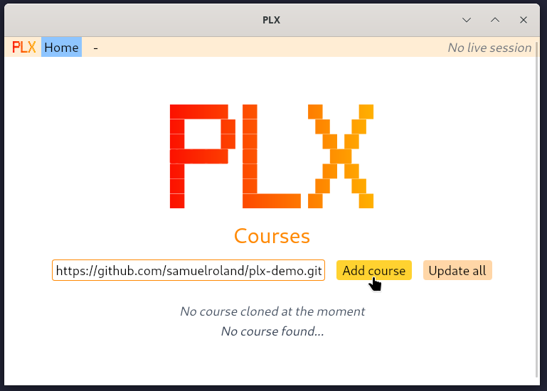
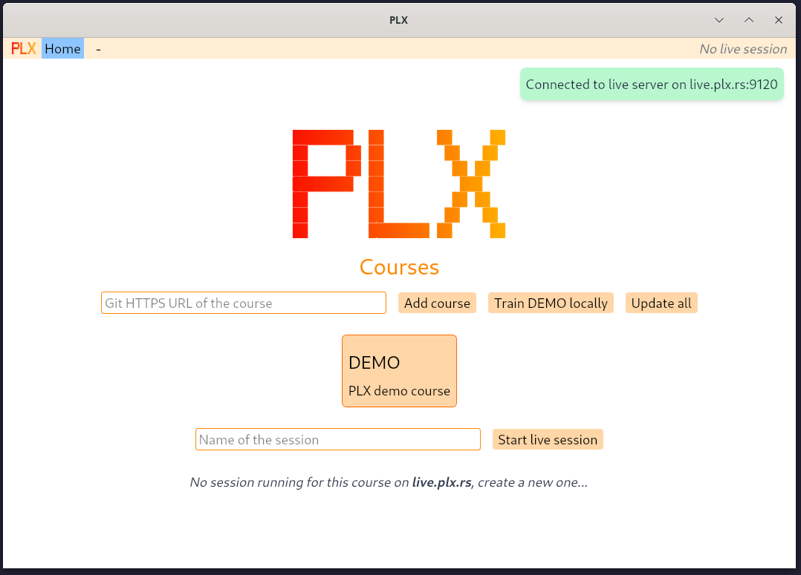
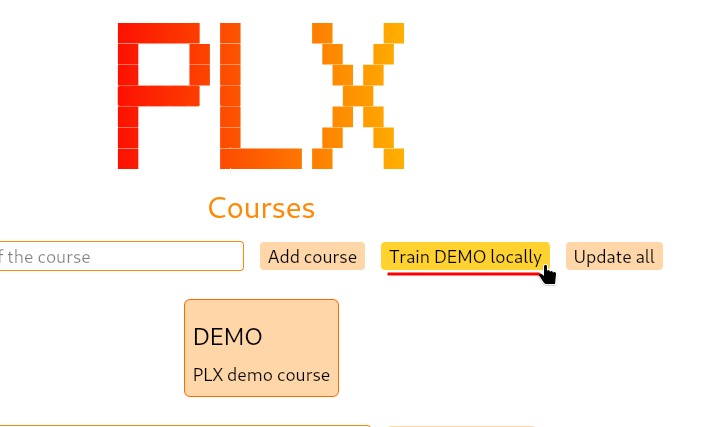
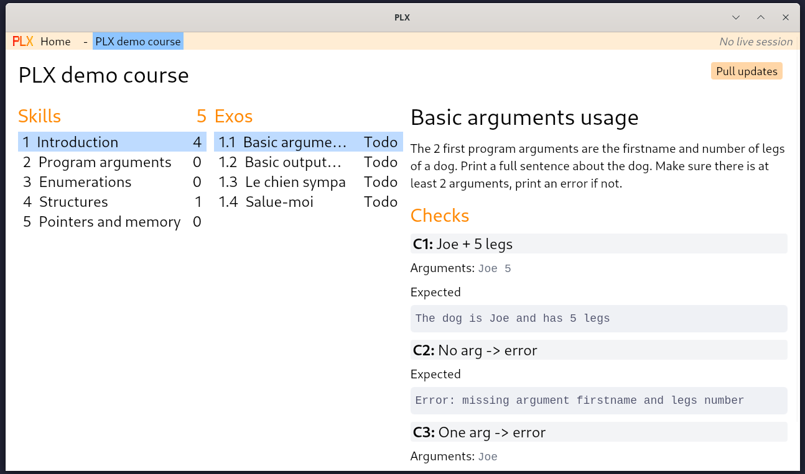
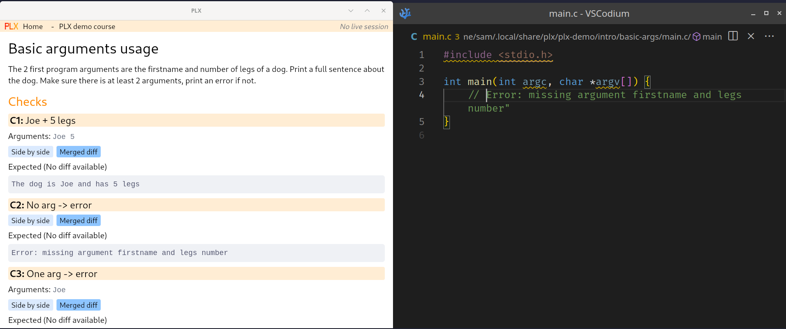
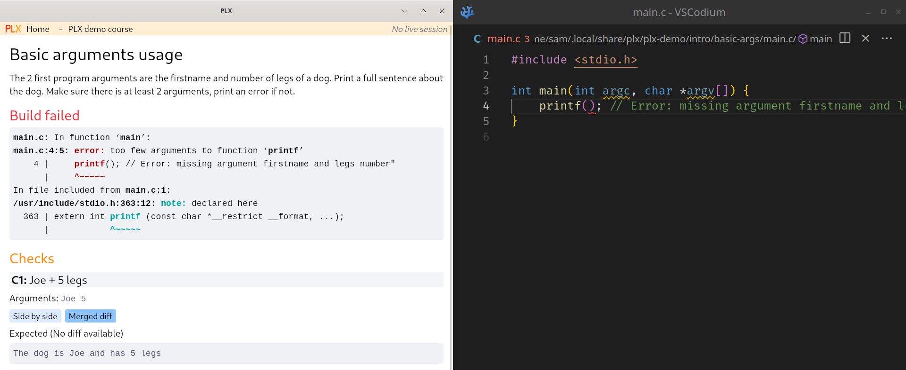
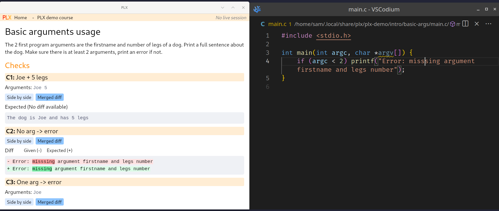

<center>


</center>

### **P**ractice programming exos in a deliberate **L**earning e**X**perience

###### Useful links
[Website](https://plx.rs) -
[WHY ?](https://plx.rs/book/why.html) -
[Git repository of PLX website](https://github.com/plx-pdg/plx-pdg.github.io)

### Introduction

PLX is a project developed to enhance the learning of programming languages, with a focus on a smooth and optimized learning experience. The goal of this project is to reduce the usual friction involved in completing coding exercises (such as manual compilation, running, testing, and result verification) by automating these steps.

PLX offers a terminal user interface (TUI) developed in Rust and supports multiple languages (currently C and C++). It enables automatic compilation as soon as a file is saved, automated checks to compare program outputs, and instant display of errors and output differences. The solution code can also be displayed. The project draws inspiration from [Rustlings](https://rustlings.cool/) and aims to create a more efficient learning experience, particularly for programming courses at HEIG-VD.

<!--
TODO: update and refactor those docs ?? Or merge with Delibay's docs ?
### Docs

We deploy documentations on [our website](https://plx.rs/book).
-->

## Develop

<details>
<summary>Details</summary>
You need Git and the Rust toolchain 1.87 ([See installation via Rustup](https://rustup.rs/)). You also need a C or C++ compiler, depending on what programming language you want to use.

```sh
git clone https://github.com/samuelroland/plx.git
cd plx
```

### Developing on the core library only
```sh
cargo build
```

Look at `src/lib.rs` for now and generate the doc with `cargo doc` to understand more about the available data structures.

How to run tests
```sh
cargo test
```

How to run tests and include ignored tests (they are marked as `#[ignored]` because they need network access or are slow to run)
```sh
cargo test -- --include-ignored
```

### The PLX CLI

<details>
<summary>Details</summary>

This will install all necessary dependencies and build the program in release mode.
```bash
cd cli
cargo build --release
```

To run it
```bash
cd cli
cargo run
```

Install the CLI globally
```bash
cd cli
cargo install --path .
```

Now you can try to run the `plx` command in your terminal. If `~/.cargo/bin` is in your PATH, the command should be found.
</details>

### The PLX desktop app
#### Or compile PLX desktop yourself

<details>
<summary>Compilation dependencies</summary>

1. Make sure you have the Tauri prequisites so all build dependencies will be present: [Tauri prequisites](https://tauri.app/start/prerequisites/)
1. The frontend is built using [NodeJS v22+](https://nodejs.org) and [Pnpm 10+](https://pnpm.io/), make sure you have both of them
</details>

#### Running the desktop app for development
<details>
<summary>Details</summary>

Just run
```sh
cd desktop
pnpm install
pnpm tauri dev
```
</details>

#### Building the desktop app for production
<details>
<summary>Details</summary>

**WARNING: This is working mostly on Linux, installers for Windows are generated as `.msi` and for MacOS as `.dmg` but some features have not been tested or do not work**.
1. To build and generate a bundle for your platform
    ```sh
    cd desktop
    pnpm install
    pnpm tauri build && pnpm tauri bundle
    ```
1. On Fedora
   ```sh
   sudo dnf install src-tauri/target/release/bundle/deb/plx_0.1.0_amd64.deb
   ```
1. Or on Ubuntu
   ```sh
   sudo apt install src-tauri/target/release/bundle/rpm/plx-0.1.0-1.x86_64.rpm
   ```
1. On Windows: look at the generated `.msi` under `src-tauri/target/release/bundle/msi`.
1. On MacOs: look at the generated `.dmg` under `src-tauri/target/release/bundle/dmg`.
</details>

</details>

## Try the desktop app
We provide demo builds to test early versions of PLX, here are the steps to setup these versions.

**Prequisites**
- Install Git and VSCode (or VSCodium, in this case when `code` is mentionned, replace with `codium` if you have VSCodium instead.)
- If you want to do C: install `gcc` (except if you are on MacOs where the existing `clang` is enough)
- If you want to do C++: install `g++`

**Steps**
1. **Get a demo build** under the [releases](https://github.com/samuelroland/plx/releases) and pick the correct bundle depending on your platform
1. **Install the bundle**
    1. On Windows or MacOS, double click on the installer
    1. On Linux
        1. On Fedora run `sudo dnf install plx-*.rpm` to install the downloaded RPM
        1. On Ubuntu run `sudo apt install ./plx-*.deb` to install the downloaded DEB

1. **Open PLX desktop with the env variable EDITOR defined**. This variable is necessary to indicate to PLX which IDE to open.
    1. On MacOS
        - You may need to accept the untrusted app under Privacy and Security in your Settings
        - You may need to right click > Open, on the plx.app package under `/Applications` to mark the application as trusted
        - This is not ideal for now but you have to open it via absolute path like this to be able to define the `EDITOR` variable to `code`
            ```sh
            EDITOR=code /Applications/plx.app/Contents/MacOS/plx-desktop
            ```
    1. On Windows, you can define the variable once globally and then open via the start menu. In Powershell in admin mode run this:
        ```sh
        setx.exe /m EDITOR code.cmd
        ```
    1. On Linux, run the desktop app with this command
        ```sh
        EDITOR=code plx-desktop
        ```

Tip: If VSCode doesn't open, you can open it yourself and retry. In some cases, this might help PLX to open the first time.

## Testing using a demo course

We have a small demo course with a few exos in C and C++ to let you try it out.

<!--
[!IMPORTANT] 
Set the $EDITOR environment variable if you wish for your editor to be opened when starting an exo

[!WARNING] 
The open editor feature is currently unstable, using a terminal based editor causes problems
The following editors were tested and work fine: `code`, `clion` and `codium`

> [!IMPORTANT] 
> Only C and C++ exercises are valid for now, java and other languages support is comming soon™
-->

1. Clone the demo course: To test PLX with a demo course, use this repository  
`https://github.com/samuelroland/plx-demo.git`  
paste this in the input on the home page and click on the `Add course` button.
    
    
1. Click on the DEMO course, it shoult connect to the live server on `live.plx.rs`.

    

1. Open the DEMO course for training locally

    
1. You should see a course a bit like that

    
1. You can click on skill `Introduction` and then double click on the first exo in C, your IDE should open on the `main.c` and you should see the details of the exo.

    
1. You can try to introduce a build error and see the output directly in PLX

    

1. You can try to do the exo and make the checks in PLX to pass. If you do little mistakes, the diff system will show you where the output is incorrect.
    

At this point, if all these situations are working, PLX is fully working on your machine.

### License

We are currently waiting for our school's approval before applying an open source license.
